# Copy Dialog Lunar Lander

Here is one of the most pressing issues of our times: You need to download a huge file from the other side of the world to continue your work. You literally can't do anything but wait.

Now there is finally a solution to this problem! Play lunar lander in these inviting hills generated by the progress dialog. Time flies when you are having fun!

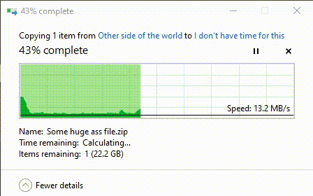

## Multiple difficulty settings!
There are multiple difficulty settings to choose from:
* **Easy**: Just copy a huge file from a local SSD to another local SSD.\

* **Medium**: Copy a big file to a crappy USB 2.0 stick.\
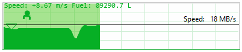
* **Hard**: Probably your work VPN that connects you to the office on the other side of the world. As a plus point, you have more time to complete the level here. Way more time.\
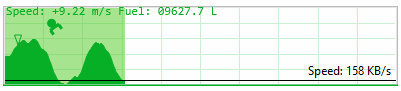

## Infinite levels, infinite replayability!
There are infinite levels, thanks to general unreliability of storage devices, the internet and VPNs.
Even playing the same 'level' twice might result in totally different landscapes, infinite replayability is guaranteed!

## Visit many exciting worlds!
Unlike the lunar lander from the olden times, this one is not limited to visiting just the moon, here are some other worlds you can visit:
* **Lush green forest**: The default world you visit. Just copy any file to reach this world.\
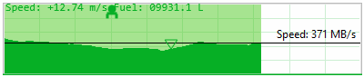
* **Scorching hot desert**: Just press *pause* on your copy operation to visit this world.\
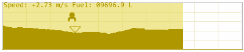
* **Frozen ice planet**: You can visit this world by enabling *high contrast mode* in Windows.\
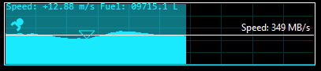
* **Nuclear wasteland**: By combining *pause* and *high contrast mode* from above you can unlock this nightmarish world.\
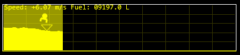

## Create your own worlds (with the OS built-in level editor)!
If the above worlds are not your cup of tea, you can create your own! Simply enable *high contrast mode* and change the *Hyperlinks* color for the *paused* world and the *Selected Text* color for the normal world. That's 16.7 million worlds that you can visit!

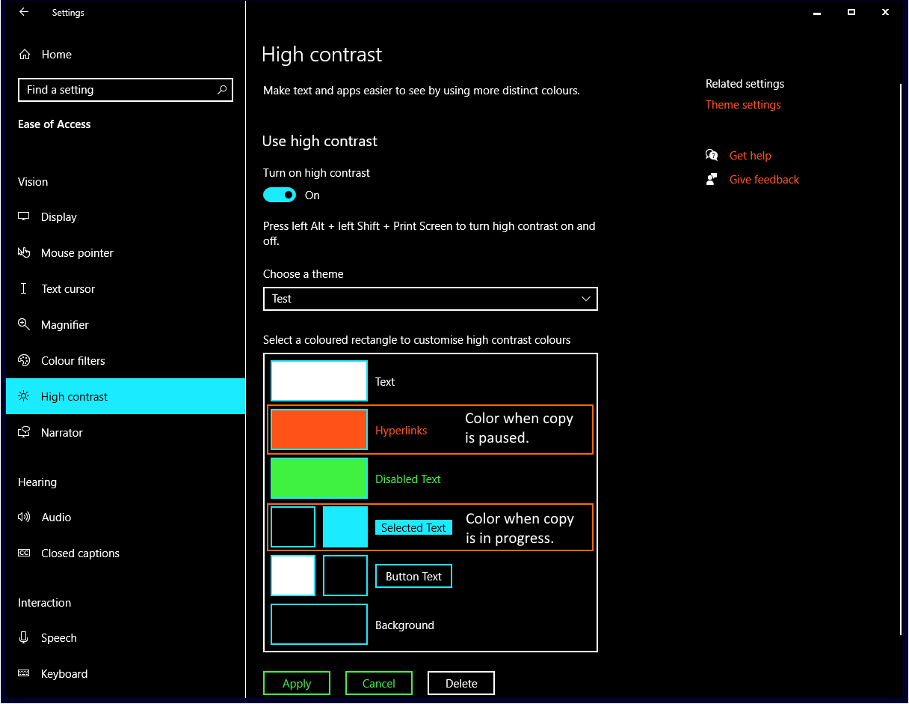\
Here some examples of what worlds await you:

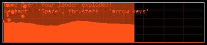
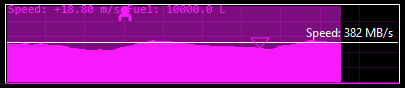

# Building

Needs at least Windows 10 for handling dpi scaling correctly. Only tested on Windows 10 21H2 so far. Windows 11 is untested.

* `git clone` into some folder and go there.
* `git submodule init`
* `git submodule update`
* Open `Copy Dialog Lunar Lander.sln` in Visual Studio 2019.
* Build and run.

# Gameplay

Once running, a tray icon is added that can be used to exit the app, change the difficulty in case your moon lander explodes even on flat terrain.
* **Hard** means you need to be below 5m/s when touching the ground.
* **Easy** eases the limit to below 10m/s.

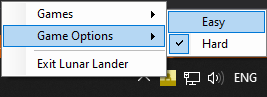

While running, the app will detect all windows copy dialogs and paint a game overlay on top of them while they are focused. You can then click in the progress graph to begin playing.
Controls:
* **left, right, down** arrow keys control the thrusters.
* **space** restarts the game.
* **tab** enables debug rendering and frame statistics which can be used to see how badly optimized my code is.

# Contributing

Contributions are always welcome!\
You can even make new games by deriving from `OverlayWindow` and implementing `GameInterface`. Any non-abstract class will show up in the tray icon so you can switch to your new game.\
Your imagination is only limited by the 395x85 logical units size of the progress chart.

If you have too much time on your hands, consider contributing to [box2d-standard](https://github.com/codingben/box2d-netstandard) instead. It's used in this project to drive the lunar lander (mostly into the ground and then to explode).

# Known Issues

* Sometimes clicking on the **Click here to play** message does not work and the game overlay gets unfocused. Not sure why that is. Just click twice again until it works.
* Dragging from one monitor to another with a different DPI causes the overlay to spasm out. Just drag the copy dialog a bit further and it will fix itself. Not sure why that happens but I already wasted too much time on this joke so I left it as is but hey, [contributions](#contributing) are always welcome!
